# WebJEA Integration psake Task Diagram

> Auto-generated by `Export-PsakeDiagram.ps1` from `integration.psake.ps1`.
> Arrows show **dependency order** — the tail node executes before the head node.
> Tasks marked `*` carry a `-PreCondition` and may be skipped at runtime.

```mermaid
flowchart TD

    classDef callerScript fill:#2d2d6b,stroke:#7777cc,color:#fff,font-weight:bold,font-style:italic
    classDef entryTask    fill:#145214,stroke:#4caf50,color:#fff,font-weight:bold
    classDef conditional  fill:#6b3a00,stroke:#ff9800,color:#ffe0b2

    %% -- Caller Scripts (hexagon = external entry point) --
    S_TestDeploy_ps1{{"TestDeploy.ps1"}}
    S_ShutdownVM_ps1{{"ShutdownVM.ps1"}}
    S_ResetVM_ps1{{"ResetVM.ps1"}}
    S_Invoke_IntegrationTests_ps1{{"Invoke-IntegrationTests.ps1"}}

    %% -- Invocation Edges --
    S_TestDeploy_ps1 -->|invokes| T_Deploy
    S_ShutdownVM_ps1 -->|invokes| T_StopVMs
    S_ResetVM_ps1 -->|invokes| T_SnapshotMaintenance
    S_Invoke_IntegrationTests_ps1 -->|invokes| T_IntegrationTest

    %% -- Task Nodes --
    T_Init["Init"]
    T_GetCredential["GetCredential"]
    T_StartVM_DC["StartVM_DC"]
    T_StartVM_Web["StartVM_Web"]
    T_RestartVM_Web["RestartVM_Web"]
    T_StartVMs["StartVMs"]
    T_StopVM_DC["StopVM_DC"]
    T_StopVM_Web["StopVM_Web"]
    T_StopVM_Web2["StopVM_Web2"]
    T_StopVMs(["StopVMs"])
    T_CleanBuildOutput[/"CleanBuildOutput*"/]
    T_BuildPackage[/"BuildPackage*"/]
    T_ResolveBuildPackage["ResolveBuildPackage"]
    T_ResolveSettings["ResolveSettings"]
    T_StageDeployment["StageDeployment"]
    T_RunDeployScript[/"RunDeployScript*"/]
    T_DeployToVM["DeployToVM"]
    T_Deploy(["Deploy"])
    T_RevertSnapshot_Web["RevertSnapshot_Web"]
    T_ApplyUpdates_Web[/"ApplyUpdates_Web*"/]
    T_ApplyUpdates_DC[/"ApplyUpdates_DC*"/]
    T_AddSnapshot_Web["AddSnapshot_Web"]
    T_ReplaceSnapshotBaseline["ReplaceSnapshotBaseline"]
    T_SnapshotMaintenance(["SnapshotMaintenance"])
    T_ConfigureTestOutput["ConfigureTestOutput"]
    T_GetTestCredentials["GetTestCredentials"]
    T_ConfigureSsl[/"ConfigureSsl*"/]
    T_RunPesterTests["RunPesterTests"]
    T_IntegrationTest(["IntegrationTest"])

    %% -- Task Dependency Edges --
    T_Init --> T_GetCredential
    T_Init --> T_StartVM_DC
    T_StartVM_DC --> T_StartVM_Web
    T_RevertSnapshot_Web --> T_StartVM_Web
    T_StartVM_DC --> T_RestartVM_Web
    T_StartVM_DC --> T_StartVMs
    T_StartVM_Web --> T_StartVMs
    T_Init --> T_StopVM_DC
    T_Init --> T_StopVM_Web
    T_Init --> T_StopVM_Web2
    T_StopVM_Web --> T_StopVMs
    T_StopVM_DC --> T_StopVMs
    T_Init --> T_CleanBuildOutput
    T_CleanBuildOutput --> T_BuildPackage
    T_Init --> T_ResolveBuildPackage
    T_BuildPackage --> T_ResolveBuildPackage
    T_Init --> T_ResolveSettings
    T_GetCredential --> T_StageDeployment
    T_StartVMs --> T_StageDeployment
    T_ResolveBuildPackage --> T_StageDeployment
    T_ResolveSettings --> T_StageDeployment
    T_GetCredential --> T_RunDeployScript
    T_StageDeployment --> T_RunDeployScript
    T_StageDeployment --> T_DeployToVM
    T_RunDeployScript --> T_DeployToVM
    T_DeployToVM --> T_Deploy
    T_StopVM_Web --> T_RevertSnapshot_Web
    T_GetCredential --> T_ApplyUpdates_Web
    T_StartVM_Web --> T_ApplyUpdates_Web
    T_GetCredential --> T_ApplyUpdates_DC
    T_StartVM_DC --> T_ApplyUpdates_DC
    T_ApplyUpdates_Web --> T_AddSnapshot_Web
    T_StopVM_Web2 --> T_AddSnapshot_Web
    T_AddSnapshot_Web --> T_ReplaceSnapshotBaseline
    T_ApplyUpdates_DC --> T_SnapshotMaintenance
    T_ReplaceSnapshotBaseline --> T_SnapshotMaintenance
    T_Init --> T_ConfigureTestOutput
    T_Init --> T_GetTestCredentials
    T_Init --> T_ConfigureSsl
    T_ConfigureTestOutput --> T_RunPesterTests
    T_GetTestCredentials --> T_RunPesterTests
    T_ConfigureSsl --> T_RunPesterTests
    T_RunPesterTests --> T_IntegrationTest

    %% -- Styles --
    class S_TestDeploy_ps1 callerScript
    class S_ShutdownVM_ps1 callerScript
    class S_ResetVM_ps1 callerScript
    class S_Invoke_IntegrationTests_ps1 callerScript
    class T_Deploy entryTask
    class T_StopVMs entryTask
    class T_SnapshotMaintenance entryTask
    class T_IntegrationTest entryTask
    class T_CleanBuildOutput conditional
    class T_BuildPackage conditional
    class T_RunDeployScript conditional
    class T_ApplyUpdates_Web conditional
    class T_ApplyUpdates_DC conditional
    class T_ConfigureSsl conditional
```

## Legend

| Shape / Style | Meaning |
|---|---|
| Dark-blue hexagon *(italic bold)* | Caller `.ps1` script — external entry point that invokes psake |
| Green stadium `([ ])` | Entry task directly targeted by a caller script |
| Orange parallelogram `[/ /]` | Task with `-PreCondition`; may be skipped at runtime |
| Rectangle `[ ]` | Regular task — always executes when reached in the dependency chain |
| `*` suffix | Short marker for a `-PreCondition` guard |
| `-->` arrow | Dependency edge: tail node runs before head node |
| `invokes` label on edge | Caller script targets this task; psake resolves its full dependency chain |

## Caller Entry Points

| Script | psake Entry Task | Description |
|---|---|---|
| `TestDeploy.ps1` | `Deploy` | Build (optional), stage, and deploy WebJEA to the test VM |
| `ShutdownVM.ps1` | `StopVMs` | Gracefully stop all test environment VMs |
| `ResetVM.ps1` | `SnapshotMaintenance` | Revert snapshot, apply Windows Updates, create new baseline snapshot |
| `Invoke-IntegrationTests.ps1` | `IntegrationTest` | Run Pester integration tests against the deployed WebJEA site |

